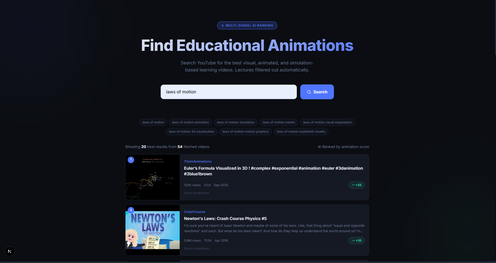
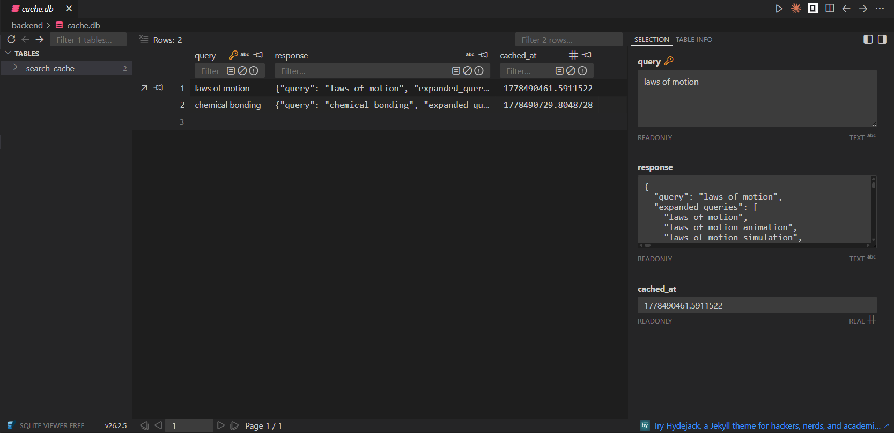

# YTSearch — Educational Animation Finder

<p align="center">
  
  
</p>

Finds and ranks YouTube videos that are genuine educational animations or simulations,
filtering out lecture/facecam content automatically.

## Architecture

```
ytsearch/
  backend/          FastAPI Python server
    app/
      main.py           API entry point (FastAPI)
      config.py         Env-var settings
      models.py         Pydantic request/response models
      query_expander.py Visual-suffix query expansion
      youtube_client.py YouTube Data API v3 async client
      face_detector.py  OpenCV Haar-cascade thumbnail analysis
      transcript_scorer.py  youtube-transcript-api analysis
      keyword_scorer.py     Title/description + channel whitelist
      scorer.py             Parallel scoring pipeline + ranking
  frontend/         Next.js 15 + Tailwind + TypeScript
    src/
      app/
        page.tsx      Main search UI
        layout.tsx    Root layout + metadata
        globals.css   Full design system
      lib/
        api.ts        Typed backend client
        utils.ts      cn() helper
```

## Scoring Pipeline

```
User Query
   -> Query Expansion (6 visual variants)
   -> YouTube API (top 50 deduplicated videos)
   -> [Parallel threads]
       Keyword Scoring      +5 per good keyword, -8 per bad
       Channel Whitelist    +30 for trusted channels
       Thumbnail (OpenCV)   -50 for large human face
       Transcript Analysis  +3 per animation signal, -5 per lecture signal
   -> Sort descending by total score
   -> Return top 20
```

## Setup

### 1. YouTube API Key

Get a free YouTube Data API v3 key from Google Cloud Console.
Enable the "YouTube Data API v3" for your project.

### 2. Backend

```powershell
cd backend
cp .env.example .env
# Edit .env and paste your key: YOUTUBE_API_KEY=AIza...
python -m venv .venv
.\.venv\Scripts\pip install -r requirements.txt
.\.venv\Scripts\uvicorn app.main:app --reload
```

Backend runs at http://localhost:8000
Swagger docs at http://localhost:8000/docs

### 3. Frontend

```powershell
cd frontend
npm run dev
```

Frontend runs at http://localhost:3000

## API Endpoints

| Method | Path        | Description                         |
|--------|-------------|-------------------------------------|
| GET    | /health     | Health check + API key status       |
| GET    | /search?q=  | Search with query string            |
| POST   | /search     | Search with JSON body               |

### POST /search body

```json
{
  "query": "laws of motion",
  "max_results": 20
}
```
